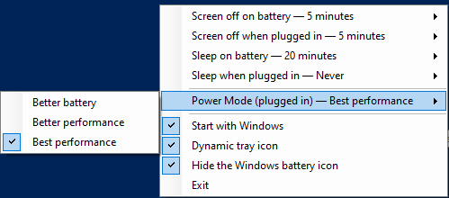

# SleepPicker

The four dropdowns from **Settings → System → Power & sleep**, as a tray menu.


Changing a screen-off or sleep timeout normally means Start → Settings → System → Power &
sleep → scroll → dropdown. SleepPicker puts the same four settings two clicks from
anywhere: click the moon in the notification area, pick a time.

## What it does

- **All four timeouts, in one menu.** Screen off and sleep, on battery and plugged in.
  Each row shows its current value inline, so all four are readable without opening
  anything, and each offers the choices Windows itself offers — 1 to 45 minutes, 1 to 5
  hours, and Never.
- **Always the live values.** The menu is rebuilt from the *active* power scheme every
  time it opens, so changes made by the Settings app, by `powercfg`, or by switching power
  plans are already there. A timeout that is not one of the presets — say 7 minutes, set
  by something else — is shown at the top, ticked, rather than leaving nothing selected.
- **A moon that is also the battery gauge.** Described below.
- **One battery indicator instead of two.** Windows' own battery meter can be switched off
  from the same menu, leaving the moon as the only one. Windows keeps that setting out of
  a user's own reach, so this is the one thing here that needs an administrator's approval,
  and the taskbar only reads it at startup, so Explorer has to restart. SleepPicker says
  both of those in a dialog and does nothing at all unless you agree; on a desktop the row
  is hidden, like the moon row. While it is on, Windows greys out its own **Power** toggle
  in Settings → Taskbar, so unticking here is the way back.
- **The power mode slider, given somewhere to live.** Hiding Windows' battery icon also
  hides the only place Windows 10 offers the power slider, so SleepPicker puts those four
  modes in the menu — but only while the icon is hidden. Described below.
- **Start with Windows.** A checkbox, and nothing more than a per-user `Run` entry.
- **Nothing to install, nothing left behind.** One 100 KB executable, no runtime, no
  configuration file, and at most four registry values under HKCU. Nothing is elevated
  except the one optional change above, and only at the moment you ask for it.

Either mouse button opens the menu. Launching SleepPicker while it is already running
opens the menu rather than adding a second icon.

## The moon

The tray icon *is* the charge: a full moon at 100%, waning through gibbous and half to a
thin crescent, and to nothing when the battery is flat. Hovering it reports the figure
exactly, and how long the battery has left at the rate it is going — `74% battery,
2 h 15 min left`, or `37 min to full` on the way back up.


Which way the charge is going is drawn the way the sky draws it. A waning moon is lit on
one limb and a waxing moon on the other, so the icon mirrors itself when the machine goes
on mains — the same phase, running the other way.

| On battery — waning | On mains — waxing |
| --- | --- |
|  |  |

Both moons are drawn together whenever the charge moves, so the cable going in swaps a
picture that is already in hand and the icon turns round as it happens rather than at some
point in the next minute. Otherwise it redraws once a minute, which no battery moves
faster than.

Two details the arithmetic alone gets wrong. Below 20% the unlit limb fades in as a ring —
real moons do this, lit by earthshine, and it means a flat battery leaves something in the
tray to click on instead of an empty slot that reads as a program that has died. And the
dark rim takes at most a quarter of the crescent's width rather than a fixed width, since
at 16px a crescent is thinner than one pixel below about 15% charge and a fixed rim would
swallow the gold whole.

The phases are drawn, not shipped: 101 levels at every size the shell can ask for would
have added more to the executable than the rest of the program weighs, and still had
nothing to show at a scaling factor nobody thought to bake. Two arcs are exact at any
size. `tools\MakeMoonPhases.py` renders the same geometry to the sheet above, so the
series can be looked at rather than only reasoned about:

```cmd
python tools\MakeMoonPhases.py
```

Untick **Dynamic tray icon** and the fixed artwork comes back — though the hover keeps
reporting charge and time, since the setting is about the picture and a tooltip is not
one. On a desktop the row is hidden, along with the two "on battery" rows — exactly as
the Settings page hides them there. Battery presence is re-checked every time the menu opens, so an undocked tablet or
a removed battery is handled without a restart.

## Power mode

Windows 10 keeps its power slider — *Power mode (on battery)* — in the flyout that hangs
off the battery icon, and nowhere else. There is no Settings page for it. So switching that
icon off takes the slider with it, and **Power Mode** appears in the menu exactly when that
happens: tick **Hide the Windows battery icon** and the row is there, untick it and the row
goes, because Windows is offering the slider again.



The four entries are the four notches of the slider. The row names the power source it is
talking about, as the flyout does, because Windows stores the mode per source — one mode on
battery, another on mains — and a click only changes the one you are running on. **Battery
saver** is offered on battery only, exactly as the slider drops its leftmost notch when the
machine is plugged in.

What the row reports is the mode **in force**, not the one last picked. Windows lowers the
mode by itself as a battery runs down, and a menu that echoed your last click back at you
would be describing a machine that no longer exists.

## Install

1. Download `SleepPicker.exe` from the
   [latest release](https://github.com/VladislavEkimtcov/SleepPicker/releases/latest).
2. Put it anywhere — it is one file and writes nothing beside itself.
3. Run it. A gold crescent appears in the notification area.
4. Optionally tick **Start with Windows**.

To uninstall: untick **Start with Windows**, choose **Exit**, delete the file.

> Windows hides new notification-area icons by default. If the moon does not appear, click
> the `^` arrow next to the clock and drag it onto the taskbar.

## Design constraints

SleepPicker targets locked-down industrial Windows — **Windows 10/11 IoT Enterprise LTSC**
and similar images — where a developer machine's assumptions do not hold. The rules the
code is written to, and which changes should keep to:

- **.NET Framework 4.8 + WinForms.** In-box on every supported image; nothing to deploy.
- **C# 5 only.** The in-box `csc.exe` is the C# 5 compiler: no string interpolation, no
  `?.`, no `nameof`, no expression-bodied members, no pattern matching, no tuples.
- **Legacy, non-SDK-style `.csproj`.** `<Project Sdk="…">` requires the .NET SDK, which is
  not present.
- **No NuGet packages**, ever — there is no restore.
- **One self-contained `.exe`.** Framework references are marked `Private=False` so
  nothing is copied beside it.
- **Never require elevation.** The manifest requests `asInvoker`, and everything the tray
  menu does works without admin rights — changing power timeouts does not need them. The
  single exception is hiding Windows' battery meter, which lives in the part of the
  registry Windows keeps read-only for the user; that one write is handed to a second copy
  of the executable started with the `runas` verb, so the prompt appears only when that row
  is ticked, and never at startup.
- **Autostart through the per-user Run key**, not a service or scheduled task.
- **Write nothing outside the user profile**, and as little as possible inside it: turning
  **Dynamic tray icon** back on deletes its value, and the key with it.

## Build from source

```cmd
build.cmd
```

That is the entire toolchain requirement. `build.cmd` uses the MSBuild that ships inside
Windows (`%WINDIR%\Microsoft.NET\Framework64\v4.0.30319\MSBuild.exe`), so it builds on a
machine with no .NET SDK, no Visual Studio, no NuGet and no package manager. Output is
`bin\SleepPicker.exe`. `warning MSB3644` is expected and harmless: with no targeting packs
installed, MSBuild resolves the framework references from the GAC instead.

The embedded icon is built from `assets\SleepPicker.png`, a crescent drawn on white. To
regenerate it after redrawing:

```cmd
powershell.exe -ExecutionPolicy Bypass -File tools\MakeIcon.ps1
```

## How it works

Timeouts are read and written through the Win32 power API in `powrprof.dll` —
`PowerGetActiveScheme`, `PowerRead{AC,DC}ValueIndex`, `PowerWrite{AC,DC}ValueIndex` —
rather than by driving `powercfg.exe`, whose output is localised and would have to be
screen-scraped. A write is followed by `PowerSetActiveScheme`, without which the new value
sits in the scheme without taking effect. The settings are the standard ones:
`SUB_VIDEO`/`VIDEOIDLE` and `SUB_SLEEP`/`STANDBYIDLE`.

The power modes are overlays — a set of tweaks laid over the active scheme without changing
it — set with `PowerSetActiveOverlayScheme` and read back with
`PowerGetEffectiveOverlayScheme`. Those exports are undocumented but have been present since
Windows 10 1709; SleepPicker probes for them once and hides the row where they are missing.
*Effective*, not *actual*, is what the menu shows, for the reason given above. "Better
performance" is no overlay at all — the active scheme left to speak for itself, which is
what Windows treats as the recommended position.

Battery saver is the one mode Windows exposes no API for whatsoever. It comes on when the
charge is at or below the energy-saver *charge level*, so SleepPicker switches it on by
raising that level to 100 — no charge is above 100 — and off by putting the level back.
What it was is written down under HKCU first, because the level is the only trace: a 100
left behind by a crash would keep battery saver on for good with nothing left to say why.
Picking any other mode puts it back and removes the note.

Whether there is a battery, how much is left in it, whether the machine is on mains, and
whether battery saver is running all come from one `GetSystemPowerStatus` call — one call, so the charge and the power
source cannot disagree and draw a moon that was never true. It reports 255 for a charge it
does not know, which is what virtual machines and some docks give back; that falls back to
the fixed icon rather than drawing 255% of a moon.

The time remaining comes from `CallNtPowerInformation(SystemBatteryState)`, in the same
`powrprof.dll`. On battery it hands back Windows' own estimate — the one the battery
flyout shows, smoothed over recent samples, where an instantaneous rate would swing with
whatever the screen is doing. Charging is the harder half: **Windows publishes no
time-to-full anywhere.** `GetSystemPowerStatus` returns −1 for it by definition, and
WMI's `Win32_Battery.TimeToFullCharge` comes back empty on the machines that matter. So
SleepPicker does the arithmetic Windows' own flyout does — what is left to put in,
divided by the rate it is going in at, both of which that same call reports. When the
rate is unknown or zero, which is a full battery or one a vendor is holding at 80%, the
hover says "charging" rather than inventing a figure; anything over 24 hours, which is
what a trickle at the end of a charge divides out to, is discarded the same way.

```
src/
  Program.cs         entry point and single-instance guard
  TrayApp.cs         the notification icon and its menu
  PowerSettings.cs   powrprof.dll interop
  PowerTarget.cs     one setting on one power source
  PowerModeSettings.cs  the power slider: overlay interop, and battery saver
  PowerMode.cs       one position of that slider
  MoonIcon.cs        draws the moon at a given phase, waning or waxing
  BatteryReading.cs  one look at the battery: charge, power source, time remaining
  Settings.cs        the dynamic-icon preference, under HKCU
  AutoStart.cs       the Run-key checkbox
  BatteryMeter.cs    hides Windows' own battery icon, and restarts the shell to show it
  SingleInstance.cs  mutex plus "show the menu" signal
tools/
  MakeIcon.ps1       regenerates the .ico from assets/SleepPicker.png
  MakeMoonPhases.py  renders docs/moon-phases.png from MoonIcon.cs's geometry
bin/SleepPicker.exe  the build, committed so it can just be downloaded
```
