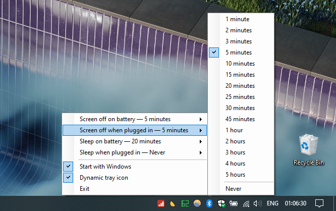
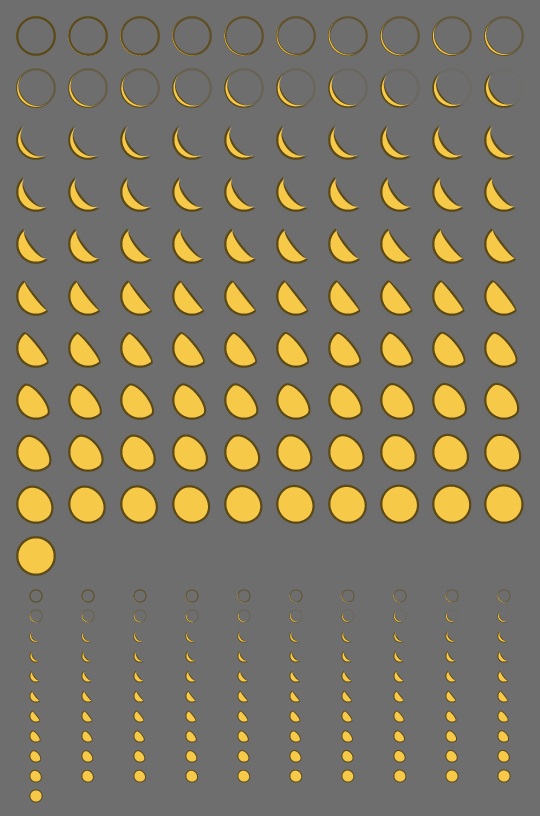

# SleepPicker

The four dropdowns from **Settings → System → Power & sleep**, as a tray menu.



Changing a screen-off or sleep timeout in Windows normally means Start → Settings → System
→ Power & sleep → scroll → dropdown. SleepPicker puts the same four settings two clicks
from anywhere: click the moon in the notification area, pick a time.

That is the whole program. There is no window, no settings dialog, no configuration file,
and nothing running but a single 93 KB executable.

## What the menu does

| Row | Changes |
| --- | --- |
| Screen off on battery | Turn off the display after, on battery |
| Screen off when plugged in | Turn off the display after, plugged in |
| Sleep on battery | Put the PC to sleep after, on battery |
| Sleep when plugged in | Put the PC to sleep after, plugged in |

Each row shows its current value inline, so all four are readable at a glance without
opening anything. Each opens a submenu with the same choices Windows itself offers — 1, 2,
3, 5, 10, 15, 20, 25, 30, 45 minutes, 1 to 5 hours, and Never — with a tick on the value
currently in force.

Below them:

- **Start with Windows** — a checkbox that adds or removes a per-user entry under
  `HKCU\Software\Microsoft\Windows\CurrentVersion\Run`.
- **Dynamic tray icon** — a checkbox, on by default, described below.
- **Exit** — quits and removes the icon.

Either mouse button opens the menu. Launching SleepPicker while it is already running does
not add a second icon; it opens the menu instead.

## The dynamic tray icon

With **Dynamic tray icon** ticked, the moon in the notification area shows how much charge
is left: a full moon at 100%, waning through gibbous and half to a thin crescent, and to
nothing at all when the battery is flat. Hovering it reports the figure exactly.



The moon wanes the way the real one does — a full disc that thins into the same crescent
the executable's own icon is drawn as. Below 20% the unlit limb starts to show as a faint
ring, brightest at 0%: real moons do this too, lit by earthshine, and it means a flat
battery leaves something in the tray to click on rather than an empty slot that looks like
a program that has died.

The icon redraws once a minute. A battery does not move faster than that, and it means the
whole feature costs one timer tick an hour of anything measurable. Untick the option and
the fixed artwork comes back.

The phases are drawn rather than shipped: 101 levels at every size the shell can ask for
would have added more to the executable than the rest of the program weighs, and still had
nothing to show at a scaling factor nobody thought to bake. Two arcs cost nothing and are
exact at any size. `tools\MakeMoonPhases.py` renders the same geometry to the sheet above,
so the series can be looked at rather than only reasoned about:

```cmd
python tools\MakeMoonPhases.py
```

### On machines without a battery

The two "on battery" rows are hidden on a desktop, exactly as the Settings page hides them
there, and so is **Dynamic tray icon** — there is no charge for it to show. Battery
presence is re-checked each time the menu opens, so a tablet that gets undocked, or a
laptop whose battery is removed, is handled without a restart.

### Values set by something else

Settings are read live from the **active** power scheme every time the menu opens, so
changes made by the Settings app, by `powercfg`, or by switching power plans show up
immediately. If the current timeout is not one of the offered choices — say another tool
set it to 7 minutes — the submenu shows that value at the top, ticked, rather than
appearing to have nothing selected.

## Install

1. Download `SleepPicker.exe` from the
   [latest release](https://github.com/VladislavEkimtcov/SleepPicker/releases/latest).
2. Put it anywhere you like — it is one file and writes nothing beside itself.
3. Run it. A gold crescent appears in the notification area.
4. Optionally tick **Start with Windows**.

No installer, no administrator rights, no runtime to install. Changing power timeouts does
not require elevation, so SleepPicker never asks for it.

To uninstall: untick **Start with Windows**, choose **Exit**, delete the file.

> Windows hides new notification-area icons by default. If the moon does not appear, click
> the `^` arrow next to the clock and drag it onto the taskbar, or allow it under
> *Taskbar settings → Select which icons appear on the taskbar*.

## Build from source

```cmd
build.cmd
```

That is the entire toolchain requirement. `build.cmd` uses the MSBuild that ships inside
Windows (`%WINDIR%\Microsoft.NET\Framework64\v4.0.30319\MSBuild.exe`), so it builds on a
machine with no .NET SDK, no Visual Studio, no NuGet and no package manager. Output is
`bin\SleepPicker.exe`, a single self-contained file.

`warning MSB3644` ("reference assemblies … were not found") is expected and harmless: with
no targeting packs installed, MSBuild resolves the framework references from the GAC
instead, and the build succeeds.

The icon is built from `assets\SleepPicker.png`, a crescent drawn on a solid white
background. To regenerate `assets\SleepPicker.ico` after redrawing it:

```cmd
powershell.exe -ExecutionPolicy Bypass -File tools\MakeIcon.ps1
```

That keys the white out to transparency, scales the artwork down to the six sizes the
shell asks for, and packs them into one `.ico` — with System.Drawing alone, since the
target machines have no image editor.

## Design constraints

SleepPicker targets locked-down industrial Windows — **Windows 10/11 IoT Enterprise LTSC**
and similar images — where a developer machine's assumptions do not hold. The rules the
code is written to, and which changes should keep to:

- **.NET Framework 4.8 + WinForms.** In-box on every supported image; nothing to deploy.
- **C# 5 only.** The in-box `csc.exe` is the C# 5 compiler: no string interpolation, no
  `?.`, no `nameof`, no expression-bodied members, no pattern matching, no tuples.
- **Legacy, non-SDK-style `.csproj`.** `<Project Sdk="…">` requires the .NET SDK, which is
  not present.
- **No NuGet packages**, ever — there is no restore.
- **One self-contained `.exe`.** Framework references are marked `Private=False` so nothing
  is copied beside it.
- **Never require elevation.** The manifest requests `asInvoker`.
- **Autostart through the per-user Run key**, not a service or scheduled task: no admin
  rights needed, and a tray icon has to run in the interactive session anyway.
- **Write nothing outside the user profile.** SleepPicker writes at most two registry
  values, and only when you change a checkbox away from its default. Turning **Dynamic
  tray icon** back on deletes its value, and the key with it.

## How it works

Timeouts are read and written through the Win32 power API in `powrprof.dll` —
`PowerGetActiveScheme`, `PowerRead{AC,DC}ValueIndex`, `PowerWrite{AC,DC}ValueIndex` — rather
than by driving `powercfg.exe`. That avoids screen-scraping localised console output, and
works on any UI language. A write is followed by `PowerSetActiveScheme`, without which the
new value sits in the scheme without taking effect.

The settings themselves are the standard ones:

| Setting | Subgroup GUID | Setting GUID |
| --- | --- | --- |
| Turn off display after | `SUB_VIDEO` `7516b95f-…` | `VIDEOIDLE` `3c0bc021-…` |
| Sleep after | `SUB_SLEEP` `238c9fa8-…` | `STANDBYIDLE` `29f6c1db-…` |

Whether there is a battery, and how much is left in it, both come from one
`GetSystemPowerStatus` call. It reports 255 for a charge it does not know — which is what
virtual machines and some docks give back — and that case falls back to the fixed icon
rather than drawing 255% of a moon.

## Layout

```
SleepPicker.csproj   legacy MSBuild 4.0 project
build.cmd            build with the in-box MSBuild
src/
  Program.cs         entry point and single-instance guard
  TrayApp.cs         the notification icon and its menu
  PowerSettings.cs   powrprof.dll interop
  PowerTarget.cs     one setting on one power source
  MoonIcon.cs        draws the moon at a given phase
  Settings.cs        the dynamic-icon preference, under HKCU
  AutoStart.cs       the Run-key checkbox
  SingleInstance.cs  mutex plus "show the menu" signal
  app.manifest       asInvoker, per-monitor DPI, visual styles
assets/
  SleepPicker.png    the artwork, drawn on white
  SleepPicker.ico    generated from it, embedded in the exe
tools/
  MakeIcon.ps1       regenerates the .ico from the .png
  MakeMoonPhases.py  renders docs/moon-phases.png from MoonIcon.cs's geometry
bin/SleepPicker.exe  the build, committed so it can just be downloaded
```
